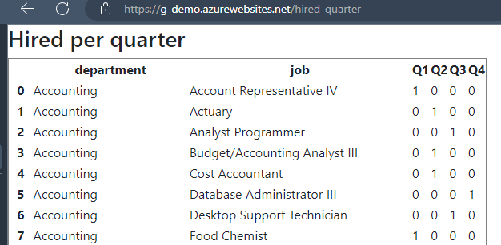
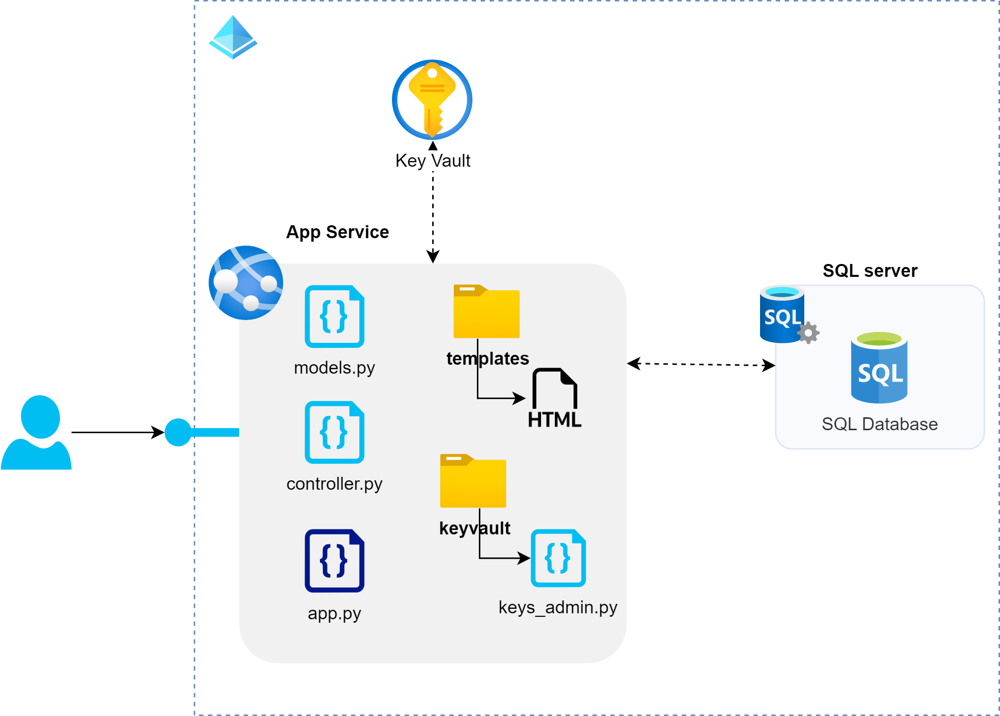

# Welcome to G-Challenge _by Luis Benitez_
This is an API demo deployed as solution of “Data Engineering Coding Challenge”

There are avalible three endpoints to upload .csv files and two more to get information about hired employees


## QuickStart
All services and architecture of solution run on Azure Cloud.

**The service is only avalible on:** [https://gdemoapplb-abcgf9fzadc3ehbx.eastus2-01.azurewebsites.net](https://gdemoapplb-abcgf9fzadc3ehbx.eastus2-01.azurewebsites.net) during limited time. 

If you need extend the time to make test, please contact with the administrator

_Please check the endopints and methods avalible to do your own requests in the next sections._

## Uploading data
You can upload new data **(only uploads with replacement are available)** over the three different tables: departments, jobs and hired_employees

* Only **Uploads without header** in file is avalible

**Structure of table ‘departments’**
| column     | type    | description                                 |
|------------|---------|---------------------------------------------|
| id         | INTEGER | Id of the department                        |
| department | STRING  | Name of the department (255 characters max) |
|            |         |                     |


**Structure of table jobs**
| column | type    | description                          |
|--------|---------|--------------------------------------|
| id     | INTEGER | Id of the job                        |
| job    | STRING  | Name of the job (255 characters max) |
|        |         |                                      |


**Structure of table hired_employees**
| column        | type     | description                                           |
|---------------|----------|-------------------------------------------------------|
| id            | INTEGER  | Id of the employee                                    |
| datetime      | DATETIME | Hire datetime in format Y-m-d[T]:H:M:S[Z]             |
| department_id | INTEGER  | Id of the department which the employee was hired for |
| job_id        | INTEGER  | If of the job wich the employee was hired for         |

**Only .csv files are supported, be sure of uploading csv separated  by comma and compatible with the schemas listed before.**

### Uploading departments [POST]
**Endpint**: https://gdemoapplb-abcgf9fzadc3ehbx.eastus2-01.azurewebsites.net/upload_departments

**Example of request in Python**
```python
import requests

url = "https://gdemoapplb-abcgf9fzadc3ehbx.eastus2-01.azurewebsites.net/upload_departments"

payload = {'chunk': '1000'} #Optional (INSERT chunk-size)
files=[
  ('file',('departments.csv',open('yourdata/departments.csv','rb'),'text/csv'))
]
headers = {}

response = requests.request("POST", url, headers=headers, data=payload, files=files)

print(response.text)
```

**Succesfull request**
```json
{
    "error": false,
    "file-uploaded": "departments",
    "msg": null,
    "status": true,
    "uploaded": true
}

```

**Failed request**
```json
{
    "error": true,
    "msg": "error <type> [description]",
    "status": false
}
```

### Uploading jobs [POST]
**Endpint**: https://gdemoapplb-abcgf9fzadc3ehbx.eastus2-01.azurewebsites.net/upload_jobs

**Example of request in Python**
```python
import requests

url = "https://gdemoapplb-abcgf9fzadc3ehbx.eastus2-01.azurewebsites.net/upload_jobs"

payload = {'chunk': '1000'} #Optional (INSERT chunk-size)
files=[
  ('file',('jobs.csv',open('yourdata/jobs.csv','rb'),'text/csv'))
]
headers = {}

response = requests.request("POST", url, headers=headers, data=payload, files=files)

print(response.text)
```

**Succesfull request**
```json
{
    "error": false,
    "file-uploaded": "jobs",
    "msg": null,
    "status": true,
    "uploaded": true
}

```

**Failed request**
```json
{
    "error": true,
    "msg": "error <type> [description]",
    "status": false
}
```

### Uploading hired_employees [POST]
**Endpint**: https://gdemoapplb-abcgf9fzadc3ehbx.eastus2-01.azurewebsites.net/upload_employees

**Example of request in Python**
```python
import requests

url = "https://gdemoapplb-abcgf9fzadc3ehbx.eastus2-01.azurewebsites.net/upload_employees"

payload = {'chunk': '1000'} #Optional (INSERT chunk-size)
files=[
  ('file',('hired_employees.csv',open('yourdata/hired_employees.csv','rb'),'text/csv'))
]
headers = {}

response = requests.request("POST", url, headers=headers, data=payload, files=files)

print(response.text)
```

**Succesfull request**
```json
{
    "error": false,
    "file-uploaded": "hired_employees",
    "msg": null,
    "status": true,
    "uploaded": true
}

```

**Failed request**
```json
{
    "error": true,
    "msg": "error <type> [description]",
    "status": false
}
```

## Getting metrics about the data
You can explore the data that was inserted in the previous section. There are avalible two endpoints each one execute a specific SQL server Querie.

### Getting hired employees by department [GET]
> "List of ids, name and number of employees hired of each department that hired more
employees than the mean of employees hired in 2021 for all the departments, ordered
by the number of employees hired (descending)."

For this question, the following SQL query is executed:
```sql
    SELECT d.id AS id, d.department AS department, COUNT(*) AS hired
        FROM hired_employees h
        INNER JOIN departments d ON h.department_id = d.id
        WHERE YEAR(h.datetime) = 2021
        GROUP BY
            d.id,
            d.department
        HAVING
            COUNT(*) > (SELECT AVG(cnt) FROM (SELECT COUNT(*) AS cnt 
            FROM hired_employees WHERE YEAR(datetime) = 2021 GROUP BY department_id) AS subquery)
        ORDER BY
            hired DESC;
```

This query makes an inner join between the tables departments and hired_employees to get only departments present in both tables where year equal to 2021.

The data are group by id of department and name.

The HAVING clausule is use to filter the departments that hired more employees that the mean during 2021. 'subquery' is a temporal table that count the number of employees per department in 2021.

AVG is used to get the mean of employees hired in all departments and the condition 'COUNT(*) > (SELECT AVG(cnt) FROM ... )' compare the total employees hired by each department with the mean of employees in all departments. Only records greater than the mean is select

#### Exploring the data [GET]
**Endpint**: https://gdemoapplb-abcgf9fzadc3ehbx.eastus2-01.azurewebsites.net/hired_department

**The best way for consulting the information is using a web explorer**, you only need to click in the previous link


**Example of request in Python**

If you prefeer to execute a request out of the web explorer, You can add _'Content-Type': 'application/json'_ to the headers and **the result returned will be a JSON file**
```python
import requests
import json

url = "https://gdemoapplb-abcgf9fzadc3ehbx.eastus2-01.azurewebsites.net/hired_department"

payload = {}
headers = {
  'Content-Type': 'application/json',
  'charset': 'utf-8'
}

response = requests.request("GET", url, headers=headers, data=payload)

print(response.text)
```

**Succesfull request**
```json
{
    "data": [
        {
            "department": "Support",
            "hired": 221,
            "id": 8
        },
        {
            "department": "Engineering",
            "hired": 208,
            "id": 5
        }
        ...
     
    ],
    "error": false,
    "msg": null,
    "status": true
}
```

**Failed request**
```json
{
    "error": true,
    "msg": "error <type> [description]",
    "status": false
}
```


### Getting hired employees by quarter [GET]
> "Number of employees hired for each job and department in 2021 divided by quarter. The
table must be ordered alphabetically by department and job."

For this question, the following SQL query is executed:
```sql
    SELECT d.department AS department,j.job AS job,
        COUNT(CASE WHEN DATEPART(QUARTER, h.datetime) = 1 THEN 1 END) AS Q1,
        COUNT(CASE WHEN DATEPART(QUARTER, h.datetime) = 2 THEN 1 END) AS Q2,
        COUNT(CASE WHEN DATEPART(QUARTER, h.datetime) = 3 THEN 1 END) AS Q3,
        COUNT(CASE WHEN DATEPART(QUARTER, h.datetime) = 4 THEN 1 END) AS Q4
    FROM
        hired_employees h
        INNER JOIN departments d ON h.department_id = d.id
        INNER JOIN jobs j ON h.job_id = j.id
    WHERE
       YEAR(h.datetime) = 2021
    GROUP BY
        d.department,
        j.job
    ORDER BY
        d.department,
        j.job;
```
This query makes an inner join among the tables departments, jobs and hired_employees to get the names of department and job for the employees filtering the data by year = 2021. 

The clausule 'COUNT(CASE WHEN DATEPART(QUARTER, h.datetime) = 1 THEN 1 END) AS Q#':

* DATEPART extract the number of quarter for the year
* CASE instruction set 1 when the condition is met. 
* COUNT sum this 
Finally we have a table group by department and job.


#### Exploring the data [GET]
**Endpint**: https://gdemoapplb-abcgf9fzadc3ehbx.eastus2-01.azurewebsites.net/hired_quarter

**Using a web explorer is the best way to consult the data**




**Example of request in Python**

If you prefeer to execute a request out of the web explorer, You can add _'Content-Type': 'application/json'_ to the headers and **the result returned will be a JSON file**
```python
import requests
import json

url = "https://gdemoapplb-abcgf9fzadc3ehbx.eastus2-01.azurewebsites.net/hired_quarter"

payload = {}
headers = {
  'Content-Type': 'application/json',
  'charset': 'utf-8'
}

response = requests.request("GET", url, headers=headers, data=payload)

print(response.text)
```

**Succesfull request**
```json
{
    "data": [
         {
            "Q1": 1,
            "Q2": 0,
            "Q3": 0,
            "Q4": 0,
            "department": "Accounting",
            "job": "Account Representative IV"
        },
        {
            "Q1": 0,
            "Q2": 1,
            "Q3": 0,
            "Q4": 0,
            "department": "Accounting",
            "job": "Actuary"
        },
        ...
     
    ],
    "error": false,
    "msg": null,
    "status": true
}
```

**Failed request**
```json
{
    "error": true,
    "msg": "error <type> [description]",
    "status": false
}
```

## Architecture of solution


The solution was created with Python (Flask) and deployed on Azure App Service using CI/CD deployment with GitHub actions.

* SQL database is only accesible for Azure services
* Key-vault is avalible on a public endpoint but only the applicacion registered and admin can read the secrets

### models.py
This file contains definitions of each table and cleaning functions.
Also there are functions to upload the data using pandas odbc driver. Also is includeed the SQL queries to consult the data uploaded.

The secrets of Key-vault is obtained here to do the connections of the database

**The access level of the key-vault and SQL server is gobernated for the Azure Active Directory and Access control policies**

### controller.py
It contains the logical for each endpoint. Manage the request and response to the user.

### app.py
It's the main file of the app. Used to starting the application

### templates (folder)
This folder contains .HTML views for the endpoints _/hired_quarter_ and _/hired_departments_

### keyvault (folder)
Is a help file to read secrets from the key-vault


## Unit test (pytest)
The unit tests include six different cases: three focused on functional testing and three specifically designed to validate functions related to data models.


## Deploy CI/CD with Docker container (step by step using Az Pipelines)
_This content was created using multiple sources of information, including the documentation of Azure services and my own experience deploying Docker images in cloud environments such as GCP and Azure_

### Step 1 Create the docker file
Develop the Docker file. This file contains the requirements, libraries, paths, base system, and programming language to be used in our application environment. Some cloud services, like Dataflow, offer base templates for Docker files. Additionally, we can find examples of Docker files for each specific service or framework environment. A Docker file looks like this:

```python
# Imagen base oficial de Python (azure app service custom container)
#https://learn.microsoft.com/en-us/azure/app-service/tutorial-custom-container?tabs=azure-cli&pivots=container-linux
#https://learn.microsoft.com/es-es/azure/devops/pipelines/apps/cd/deploy-docker-webapp?view=azure-devops&tabs=java%2Cyaml
FROM python:3.13-slim

# Install system packages by pyodbc and SQL Server
RUN apt-get update && \
    apt-get install -y gcc g++ unixodbc-dev curl gnupg && \
    curl https://packages.microsoft.com/keys/microsoft.asc | apt-key add - && \
    curl https://packages.microsoft.com/config/debian/11/prod.list > /etc/apt/sources.list.d/mssql-release.list && \
    apt-get update && \
    ACCEPT_EULA=Y apt-get install -y msodbcsql18 && \
    rm -rf /var/lib/apt/lists/*

WORKDIR /

COPY requirements.txt .

# install python libs
RUN pip install --upgrade pip && pip install -r requirements.txt

# copy app code
COPY . .

# port app
EXPOSE 5000

# env varaible 
ENV ENVIRONMENT_FLAG=prod

# execution app
CMD ["gunicorn", "--bind", "0.0.0.0:5000", "app:app"]

```

### Step 2: Crate the .yml file 
_Before proceeding with this step, it is necessary to configure a service principal in Azure DevOps with sufficient permissions over the resource group (RG) where the solution will be deployed. The repository can exist in Git (Azure DevOps) or in external services like GitHub._

The .yml file is a sequential configuration file used for deploying applications and services. It is structured similarly to this:

```python
trigger:
- main
   
pool:
  vmImage: 'ubuntu-latest'
   

variables:
  imageName: 'pipelines-javascript-docker'
  DOCKER_BUILDKIT: 1
    
steps:
- task: Docker@2
  displayName: Build an image
  inputs:
    repository: $(imageName)
    command: build
    Dockerfile: app/Dockerfile
```


### Step 3:  Save the built image on Az Container Registry
Now that we have a built Docker image, we need to store it for use in our final service destination. To store the Docker image in Azure, we can use Azure Container Registry. This step can be integrated into our deployment pipeline by updating the .yml file and configuring the Docker@2 step.

```python 
- stage: Build
  displayName: Build and push stage
  jobs:
  - job: Build
    displayName: Build
    pool:
      vmImage: $(vmImageName)
    steps:
    - task: Docker@2
      displayName: Build and push an image to container registry
      inputs:
        command: buildAndPush
        repository: $(imageRepository)
        dockerfile: $(dockerfilePath)
        containerRegistry: $(dockerRegistryServiceConnection)
        tags: |
          $(tag)
```

### Step 4 Deploy in Azure App service
Finally, we need to add an additional step to deploy our Docker image in the App Service. In Azure Pipelines, this can be done by configuring the AzureWebAppContainer@1 step in the .yml file.

```python
## Add the below snippet at the end of your pipeline
    - task: AzureWebAppContainer@1
      displayName: 'Azure Web App on Container Deploy'
      inputs:
        azureSubscription: $(azureSubscription)
        appName: $(appName)
        containers: $(containerRegistry)/$(imageRepository):$(tag)
```
And that is all!

#### References.
https://learn.microsoft.com/en-us/azure/devops/pipelines/ecosystems/containers/build-image?view=azure-devops

https://learn.microsoft.com/en-us/azure/devops/pipelines/ecosystems/containers/push-image?view=azure-devops&tabs=yaml&pivots=acr-registry

https://learn.microsoft.com/en-us/azure/devops/pipelines/apps/cd/deploy-docker-webapp?view=azure-devops&tabs=java%2Cyaml